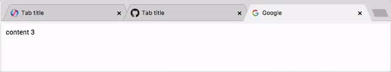

[](https://www.webcomponents.org/element/zedesk/chrome-tabs)

# \<chrome-tabs\>

Chrome tabs

Inspired by the project [chrome-tabs][1] by @adamschwartz, this project aims to create a webcomponent.



## Quick example

<!--
```
<custom-element-demo>
  <template>
    <script src="../webcomponentsjs/webcomponents-lite.js"></script>
    <link rel="import" href="chrome-tabs.html">
    <link rel="import" href="chrome-tab.html">
    <next-code-block></next-code-block>
  </template>
</custom-element-demo>
```
-->
```html
<chrome-tabs extendable selected="1" >
  <chrome-tab icon="https://www.polymer-project.org/images/logos/p-logo-32.png" title="Tab title"></chrome-tab>
  <chrome-tab icon="https://assets-cdn.github.com/favicon.ico" title="Tab title"></chrome-tab>
  <chrome-tab title="Tab title"></chrome-tab>
  <chrome-tab title="Tab title"></chrome-tab>
</chrome-tabs>
```

The component is licensed under the [ISC License](LICENSE.md)

Demo and doc are available on http://zedesk.github.io/chrome-tabs/

[1]: https://github.com/adamschwartz/chrome-tabs
